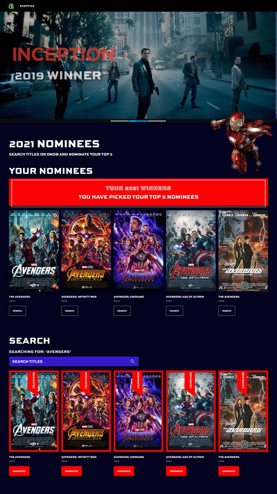
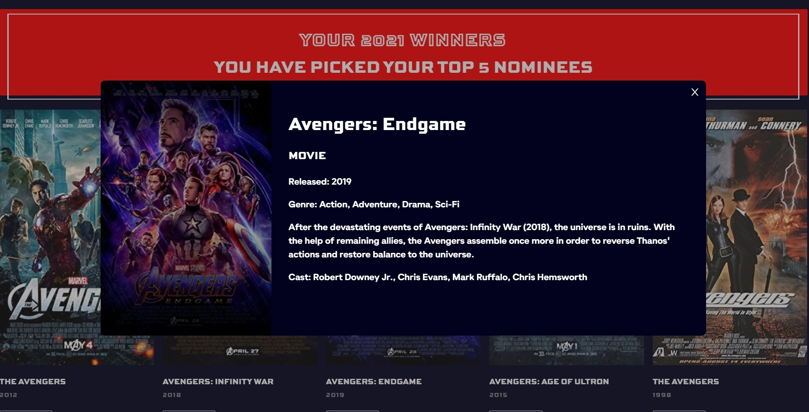

# Shopify Challenge - The Shopiees: Movie awards for entrepreneurs

Shopify has branched out into movie award shows and we need your help. Please build us an app to help manage our movie nominations for the upcoming Shoppies.

Developed with React, React Spring, Typescript, JS, HTML, CSS.

### The Challenge

We need a webpage that can search OMDB for movies, and allow the user to save their favourite films they feel should be up for nomination. When they've selected 5 nominees they should be notified they're finished.

We'd like a simple to use interface that makes it easy to:
Search OMDB and display the results (movies only)
Add a movie from the search results to our nomination list
View the list of films already nominated
Remove a nominee from the nomination list

### Technical requirements

1. Search results should come from OMDB's API (free API key: http://www.omdbapi.com/apikey.aspx).
2. Each search result should list at least its title, year of release and a button to nominate that film.
3. Updates to the search terms should update the result list
   Movies in search results can be added and removed from the nomination list.
4. If a search result has already been nominated, disable its nominate button.
5. Display a banner when the user has 5 nominations.

## External Resources:

-   Postman to test API requests.
-   Prettier to format code and EsLint for linting.
-   React dev tool to check the value of props.

## What It Looks Like




# Getting Started

These instructions will get you a copy of the project up and running on your local machine for development and testing purposes.

1. Clone the project. Use `npm install` to install all the dependencies. Go to the client directory, run the project with `npm start` for development or `npm run build` for production.

2. OPTIONAL: If you want to make changes locally, on the terminal, go to the `backend` directory. Type `npm run convert` to start the local server. The command would also listen to changes and convert the Express Typescript files to Express Javascript files that will be used for production. Create your own local database by restoring the pg_dump file of the steam database given (called steam_prod). Configure your own Pool settings in databasePool.

# Prerequisites

What things you need to install the software

```
- Any package manager (npm, yarn)
```

# Versioning

None
